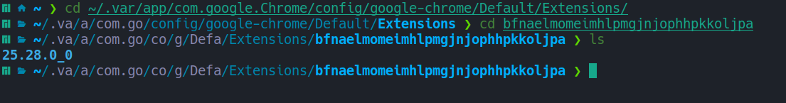

# Phantom Browser Shell

[](https://opensource.org/licenses/GPL-3.0)
[](https://nodejs.org/)
[](https://yarnpkg.com/)

**Phantom Browser Shell** is a standalone desktop application built on Electron for Linux that uses the original Phantom extension. This is a full-featured application that provides all the capabilities of the official Phantom wallet in a convenient desktop interface.

## 🛠️ Installation and Setup

### 1. Clone the repository

```bash
git clone <repository-url>
cd phantom-browser-shell
```

### 2. Install dependencies

```bash
yarn install
```

### 3. Run the application

```bash
yarn start
```

## 🔄 Updating Phantom Extension

To update the Phantom extension in the application, follow these steps:

### 1. Find the installed Phantom extension

The Phantom extension is usually located at:
```bash
~/.var/app/com.google.Chrome/config/google-chrome/Default/Extensions
```

### 2. Find the extension folder

Navigate to the folder with the Phantom extension ID:
```bash
cd ~/.var/app/com.google.Chrome/config/google-chrome/Default/Extensions/bfnaelmomeimhlpmgjnjophhpkkoljpa
```

> **Note**: The ID `bfnaelmomeimhlpmgjnjophhpkkoljpa` is constant for the Phantom extension and is the same for all users.

### 3. Copy the new version

In the extension folder, you will see a folder with the current version (e.g., `25.28.0_0`). Copy this folder to the `extensions/` directory in the project root:

```bash
cp -r 25.28.0_0 /path/to/phantom-browser-shell/extensions/
```



### 4. Restart the application

```bash
yarn start
```

## 🐛 Troubleshooting

### Extension Issues

If extensions are not loading:

1. Make sure the Phantom extension is installed in Chrome
2. Check the correctness of the extension path
3. Ensure the extension version in the `extensions/` folder is up to date

### Launch Issues

1. Check Node.js and Yarn versions
2. Delete `node_modules` and `yarn.lock`, then run `yarn install`
3. Make sure all dependencies are installed correctly

## 🤝 Contributing

We welcome contributions to the project! Please follow our guidelines:

1. Fork the repository
2. Create a branch for the new feature
3. Make changes
4. Add tests
5. Submit a pull request

## 📝 TODO

- [ ] Package for different Linux distributions (Arch, Ubuntu, APK, Yay, Pacman)
- [ ] Remove legacy code
- [ ] Optimize startup process
- [ ] Add automatic extension updates
- [ ] Improve documentation
- [ ] Add CI/CD pipeline

## 📄 License

This project is licensed under [GPL-3.0](LICENSE).

## 🙏 Acknowledgments

- [Electron](https://electronjs.org/) — framework for creating desktop applications
- [Phantom](https://phantom.app/) — cryptocurrency wallet
- [Electron Forge](https://www.electronforge.io/) — tools for building and distribution

---

**Note**: This is an unofficial implementation. Phantom is a registered trademark of its respective owners.